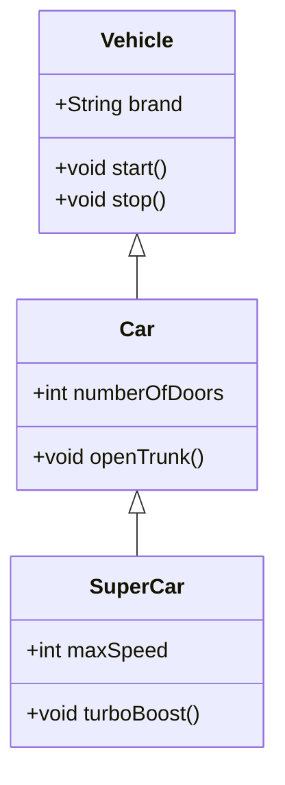

# Multiple level inheritance

> Quite similar to single but have multiple level in inheritance <br>
> Where single will have only one layer


```java
// Most general class
class Vehicle {
    String brand = "Generic Vehicle Brand";

    void start() {
        System.out.println("Vehicle is starting");
    }

    void stop() {
        System.out.println("Vehicle is stopping");
    }
}

// More specialized class
class Car extends Vehicle {
    int numberOfDoors = 4;

    void openTrunk() {
        System.out.println("Trunk is opened");
    }
}

// Most specialized class
class SportsCar extends Car {
    int maxSpeed = 300;

    void turboBoost() {
        System.out.println("Turbo boost activated! Speed: " + maxSpeed + " km/h");
    }
}

// Test class to demonstrate multilevel inheritance with specialization
public class TestMultilevelInheritance {
    public static void main(String[] args) {
        SportsCar sportsCar = new SportsCar();

        // Accessing methods and properties from SportsCar, Car, and Vehicle classes
        System.out.println("Brand: " + sportsCar.brand);          // Inherited from Vehicle
        System.out.println("Number of Doors: " + sportsCar.numberOfDoors); // Inherited from Car
        System.out.println("Max Speed: " + sportsCar.maxSpeed);   // Specific to SportsCar

        sportsCar.start();       // Method in Vehicle class
        sportsCar.openTrunk();   // Method in Car class
        sportsCar.turboBoost();  // Method in SportsCar class
        sportsCar.stop();        // Method in Vehicle class
    }
}
```



> In first section of inheritance we have seen that more up will have more generalisation <br>
> More low will have specialization.<br>
> In above class diagram you can see that vehicle have more generic member
> Supercar class have more specific member