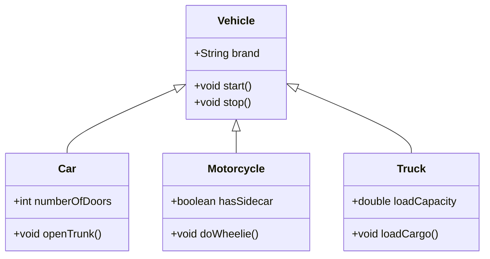

# Hierarchical Inheritance
> in real world most entity will be hierarchical inheritance.

> Hierarchical inheritance is n subclass derived from single superclass.


```java
class Vehicle {
    String brand;
    int year;

    void start() {
        System.out.println("Vehicle is starting.");
    }

    void stop() {
        System.out.println("Vehicle is stopping.");
    }
}

// Derived class 1
class Car extends Vehicle {
    int numberOfDoors;

    void openTrunk() {
        System.out.println("Car trunk is open.");
    }
}

// Derived class 2
class Motorcycle extends Vehicle {
    boolean hasSidecar;

    void doWheelie() {
        System.out.println("Motorcycle is doing a wheelie!");
    }
}

// Derived class 3
class Truck extends Vehicle {
    double loadCapacity;

    void loadCargo() {
        System.out.println("Truck is loading cargo.");
    }
}

// Test class
class TestInheritance {
    public static void main(String[] args) {
        // Creating an instance of Car
        Car car = new Car();
        car.brand = "Toyota";
        car.numberOfDoors = 4;
        car.start();
        car.openTrunk();

        // Creating an instance of Motorcycle
        Motorcycle motorcycle = new Motorcycle();
        motorcycle.brand = "Harley-Davidson";
        motorcycle.hasSidecar = true;
        motorcycle.start();
        motorcycle.doWheelie();

        // Creating an instance of Truck
        Truck truck = new Truck();
        truck.brand = "Ford";
        truck.loadCapacity = 15000;
        truck.start();
        truck.loadCargo();
    }
}
```




> The Car, MotorCycle, Truck all of them will have brand,start,stop where inherited from vehicle class