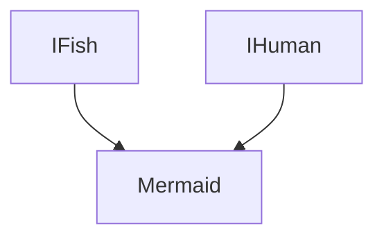

# Multiple inheritance
> 🤔 Caution Multiple and Multiple level inheritance are not same. <br>
> Both serve different purpose.


## Not Support in java
- Yes multiple inheritance is ***not supported*** directly in java there are some reason why not support in java
- But you can achieve multiple inheritance my using ***interface***

> ❎ following code will throw a compilation error

```java
class Human{
    void talk(){
        System.out.println("can able to talk");
    }
    void walk() {
        System.out.println("can able to talk");
    }
}

class Fish{
    void haveCaudalfin() {
        System.out.println("will have caudal fin");        
    }
}

class Mermaid extends Human,Fish{
    void walk(){
        System.out.println("Mermaid can swim");
    }
}
```


## How to achieve Multiple inheritance in java
- You use interface to achieve multiple inheritance
- But why java support this by using interface because interface doesn't have function body or implementation.
- Using interface we can avoid ambiguity issues 

> ✅ Following code is a correct way of implementing multiple inheritance
```java
interface IHuman{
    void talk();
    void walk();
}

interface IFish{
    void haveCaudalfin();
}

class Mermaid implements IHuman,IFish{
    void talk(){
        System.out.println("can able to talk");
    }
    
    void walk(){
        System.out.println("can able to talk");
    }


    void walk(){
        System.out.println("can able to talk");
    }


    void haveCaudalfin(){
        System.out.println("will have caudal fin");
    }
}
```



## Problem while using class
- There is a lot of ambiguous issue while implementing multiple inheritance using class
  1. Method or behaviour Name Clashes
  2. Field or attribute Name Clashes
  3. constructor Ambiguity
  4. State inconsistency
  5. Classic diamond problem

> When a class have derived from two class which having ***same name of attribute and methods***. <br>
> ***Which method should call*** while accessing the method or field <br>
> These are called method and field ambiguity

> Similarly, ***which constructor*** should call first while using **super()**

### State inconsistency
- If parent classes have same state but modifies in different way which one should apply
```java
class ParentA {
    int counter = 0;

    void increment() {
        counter++;
    }
}

class ParentB {
    int counter = 0;

    void increment() {
        counter += 2;
    }
}

// If Java allowed multiple inheritance with classes:
class Child extends ParentA, ParentB {
    // Ambiguity: Which increment method to use?
}
```

### Diamond Problem
> The diamond problem is a specific type of issue that arises from multiple inheritance, 
> particularly when a class inherits from two classes that have a common ancestor. 
> The name comes from the shape of the inheritance diagram, which looks like a diamond:

```java
class A {
    void method() {
        System.out.println("Method in A");
    }
}

class B extends A {
    @Override
    void method() {
        System.out.println("Method in B");
    }
}

class C extends A {
    @Override
    void method() {
        System.out.println("Method in C");
    }
}

// Theoretically, if Java allowed it:
class D extends B, C {
    // Ambiguity: Which method() to inherit? B's or C's?
}
```


